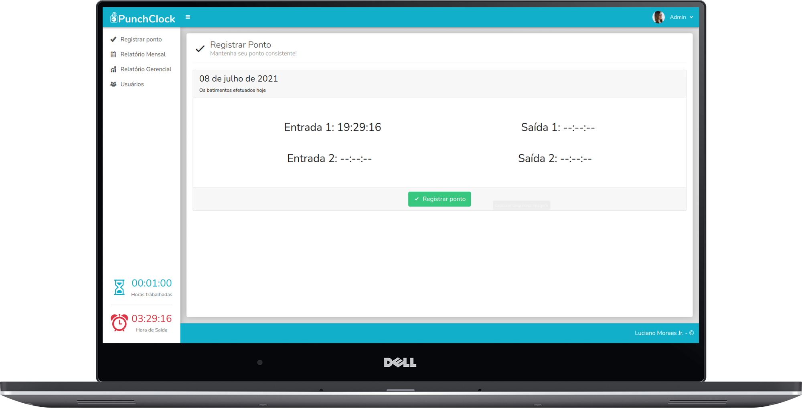

<h1 align="center">
    
</h1>

<p align="center">
  <a href="#-tecnologias">Tecnologias</a>&nbsp;&nbsp;&nbsp;|&nbsp;&nbsp;&nbsp;
  <a href="#-projeto">Projeto</a>&nbsp;&nbsp;&nbsp;|&nbsp;&nbsp;&nbsp;
  <a href="#-getting-started">Getting Started</a>&nbsp;&nbsp;&nbsp;|&nbsp;&nbsp;&nbsp;
  <a href="#memo-licença">Licença</a>
</p>

<p align="center">
 

  
</p>

<br/>

<p align="center">
  
</p>

<br/>

## 🚀 Tecnologias

Esse projeto foi desenvolvido com as seguintes tecnologias:

- [Composer](https://getcomposer.org/)
- [Laravel](https://laravel.com/)
- [MySQL](https://www.mysql.com/)
- [Bootstrap](https://getbootstrap.com/)

## 💻 Projeto

O PunchClock é um sistema de ponto eletrônico online, onde um adminsitrador previamente cadastra seus colaboradores, para que possam registrar suas horas de trabalho, e tem total controle sobre horas trabalhadas, ausências e horas em dívida. 

## ▶ Getting Started
### Requisitos:
Para rodar a aplicação, é necessário ter [Git](https://git-scm.com), [Composer](https://getcomposer.org/), [Laravel](https://laravel.com/) e [MySQL](https://www.mysql.com/) previamente instalados.

### Rodando a aplicação:
```bash
# Primeiramente, clone o repositório
git clone https://github.com/lucianogmoraesjr/punchclock.git

# Acesse a pasta da aplicação
cd punchclock/

# Instale as dependências
composer install

# Rode as migrations (opcionalmente você pode usar a flag --seed para popular o DB) 
php artisan migrate

# Rode a aplicação
php artisan serve
```
Acesse a aplicação no seu browser em: localhost:8000

## :memo: Licença

Esse projeto está sob a licença MIT. Veja o arquivo [LICENSE](LICENSE) para mais detalhes.

---

Projeto desenvolvido por [Luciano Moraes Jr.](https://github.com/lucianogmoraesjr).
